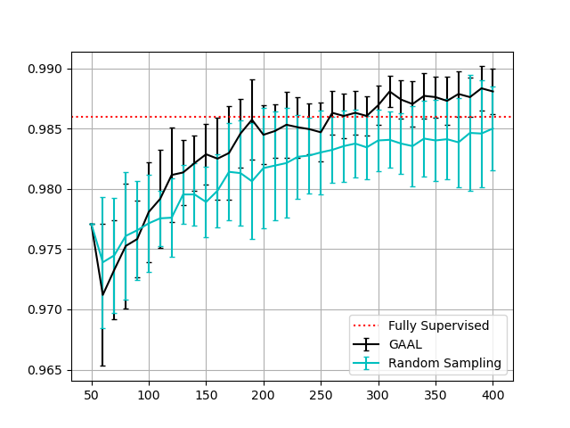
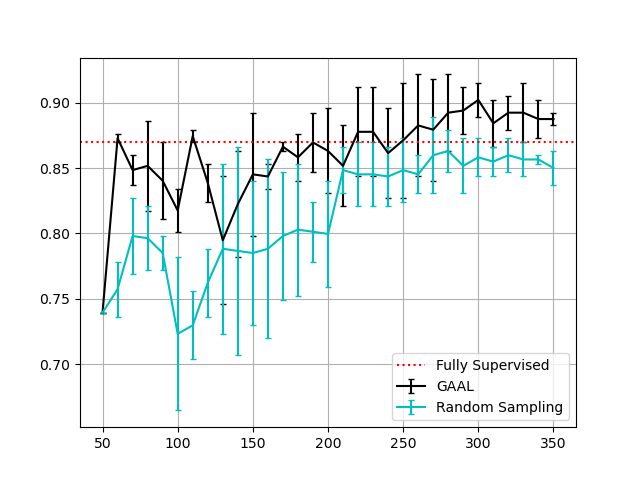

# PyTorch-GAAL

This is a PyTorch implementation of [Generative Adversarial Active Learning](https://arxiv.org/abs/1702.07956)

## Directory Structure
```
———— PyTorch-GAAL
 |__ data           # data directory
 |__ gan			# train and save DCGAN model
 |__ oracle			# pre-trained models act as human oracle
 |__ plot			
 |__ main.py		# Generate commmand to run train.py
 |__ train.py		# main training loop
 |__ utils.py		# toolbox
 |__ requirements.txt       # auto-generated dependencies file, usage: pip install -r requirements.txt
 |__ README.md
```

## Usage
Edit the parameters (dataset, label budget, etc.) in main.py, then:
```bash
python main.py
```

## My Environment (For your reference).
```
python 3.9.7 + pytorch 1.9.0 + torchvision 0.10.0 + cuda 10.1 + cuDNN 7.6.5
```
## Experiment results
1. Train on MNIST, test on MNIST. Classifying 5 and 7:


2. Train on MNIST, test on USPS. Classifying 5 and 7: 


## To be updated
- [ ]  Experiment results on CIFAR-10
- [ ]  Comparing with the SVM<sub>active</sub> algorithm

## Reference
[1] : [PyTorch DCGAN Tutorial](https://pytorch.org/tutorials/beginner/dcgan_faces_tutorial.html)

[2] : [DCGAN on CIFAR-10](https://wandb.ai/sairam6087/dcgan/reports/DCGAN-on-CIFAR-10--Vmlldzo5NjMyOQ)

